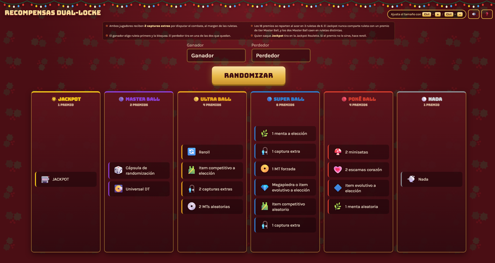
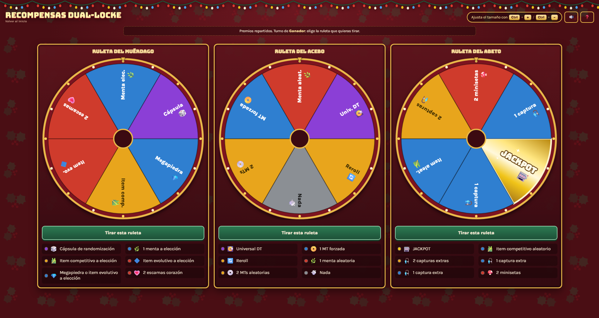
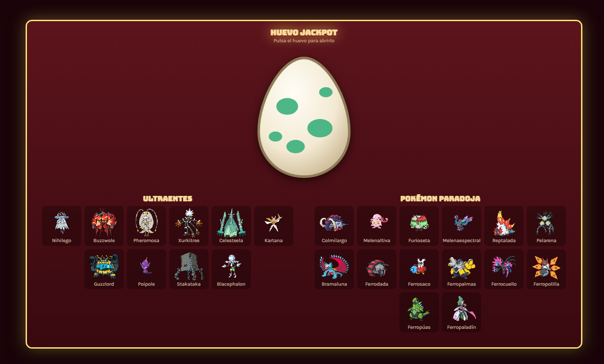

# Ruleta de Recompensas Dual-Locke

Una ruleta para repartir premios después de los combates entre los dos jugadores de un
Dual-Locke, en lugar de tirar de una ruleta improvisada de internet o de sortearlo a dedo.



## Para qué sirve

En un Dual-Locke, cada combate entre los dos jugadores debería tener premios, pero sin ventajas muy superiores para el ganador,
puesto que este ya está un punto por encima en el marcador.
Esta web coge una lista de premios, los reparte al azar en tres ruletas y monta el
sorteo entero: el ganador del combate elige la ruleta que quiere tirar y la bloquea,
y el perdedor tira en una de las dos que quedan. Los dos se llevan algo, pero el que
gana tiene ventaja porque elige primero y ve lo que hay en cada ruleta.



Cada premio acaba en cada ruleta un tercio de las
veces exactamente. Hay dos únicas restricciones, para que ninguna ruleta se quede sin
nada gordo: el Jackpot nunca comparte ruleta con un premio de Master Ball, y los dos
Master Ball siempre caen en ruletas distintas.

## Cómo usarlo

1. Descarga el proyecto (botón verde **Code → Download ZIP**) y descomprímelo.
2. Doble clic en **`iniciar.bat`**.
3. Se abre solo en el navegador. Ya está.

Se abrirá también una ventana negra: es el servidor, y tiene que quedarse abierta
mientras juegas. Para terminar, la cierras.

Necesitas tener Python instalado, que en la mayoría de ordenadores ya viene. Si no lo
tienes, el propio `iniciar.bat` te avisa y te dice de dónde bajarlo.

## Los premios se cambian desde la propia web

Esto es lo importante: **la ruleta no es del Añil**. Los premios que trae por defecto
están pensados para una partida de Pokémon Añil, pero la ruleta en sí no tiene nada que
ver con ese juego ni con ninguno. Sirve para cualquier reto, cualquier juego y cualquier
grupo de amigos.

Por eso hay un botón de lápiz ✏️ arriba a la derecha. Lo abres y ves todos los premios
como texto plano, que puedes cambiar por lo que quieras:

```
# ULTRA BALL
Reroll | 🔄 | Anula el premio y vuelves a tirar en la misma ruleta.
2 capturas extras | 🎣 | Dos capturas adicionales.
```

Cada línea es un premio: nombre, icono y explicación, separados por barras. Las líneas
que empiezan por `#` abren un tier. Le das a Guardar y la ruleta se reconstruye al
momento. Lo único que tiene que cumplirse es que el total de premios sea múltiplo de 3,
para que se puedan repartir entre las tres ruletas.

Los cambios se quedan guardados en tu navegador, así que siguen ahí la próxima vez.
Si la lías, el botón **Restaurar originales** te devuelve la lista de partida.

Cámbialo sin miedo. Está hecho para eso.

## El Jackpot y la regla del Ultraente

El Jackpot es el premio más raro de todos: solo hay uno entre los dieciocho. Cuando sale,
la pantalla se llena de fuegos artificiales y el jugador elige entre dos cosas:

- **Reroll**, si prefiere volver a tirar y probar suerte otra vez.
- **Huevo JACKPOT**, que se abre haciendo clic y del que sale, al azar, un Ultraente o
  un Pokémon Paradoja.



La idea detrás del huevo es que en toda la partida **solo puedes conseguir un Ultraente
o un Pokémon Paradoja, uno en total**. Que te toque el Jackpot una vez ya es difícil; si
te vuelve a tocar más adelante, ese segundo huevo no te da otro. Así el bicho que te
salga es único de verdad en tu equipo durante todo el locke, y no acabas con media
plantilla de Paradojas si tienes una racha buena.

De la lista se han dejado fuera los legendarios y singulares. Están los Ultraentes y los
Pokémon Paradoja normales, pero no las versiones Paradoja de los legendarios, ni
evoluciones como Naganadel.

## Qué más hay dentro

Algunos premios no se quedan en el texto y abren su propio sorteo:

- **Reroll** devuelve la tirada a la misma ruleta, las veces que haga falta.
- **1 menta aleatoria** abre una ruleta con las 25 naturalezas.
- **Item competitivo aleatorio** abre una ruleta con 50 objetos.

Y el botón de interrogación ❓ abre una chuleta con los dieciocho premios y qué hace
cada uno, por si alguien no se acuerda a media partida.

## Si quieres tocar el código

Son tres archivos sin dependencias ni nada que compilar: `index.html`, `style.css` y
`script.js`. Las listas que no salen en el editor están todas juntas al principio del
`script.js`:

| Qué                               | Dónde                        |
| ---------------------------------- | ----------------------------- |
| Naturalezas de la ruleta de mentas | `NATURALEZAS`               |
| Objetos de la ruleta competitiva   | `ITEMS_COMPETITIVOS`        |
| Pokémon del huevo                 | `ULTRAENTES` y `PARADOJA` |
| Nombres de las tres ruletas        | `NOMBRES_RULETA`            |

Si te lo llevas a otro juego que no sea Pokémon, esas ruletas secundarias se pueden
reaprovechar para lo que quieras: son listas de texto y ya está.

## Nota

Los sprites del huevo se cargan de [PokeAPI](https://github.com/PokeAPI/sprites), así que
esa pantalla necesita conexión a internet. Todo lo demás funciona sin ella.
